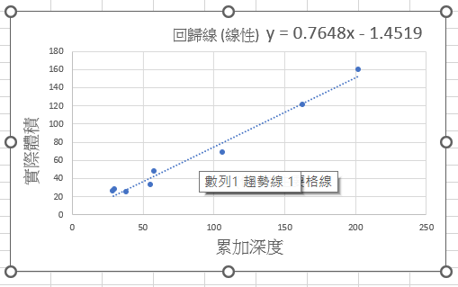
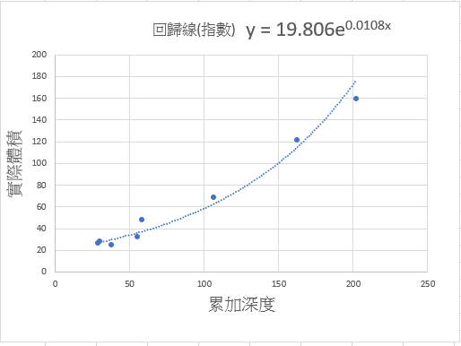
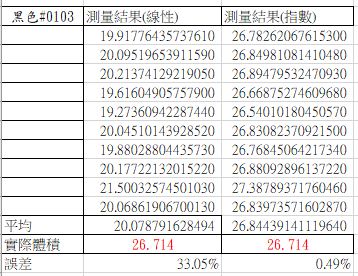
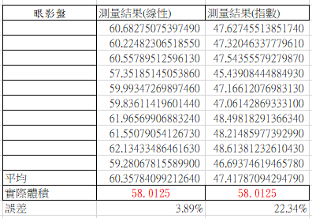
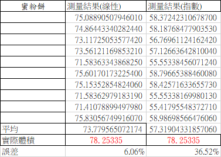

#  00911 report
## 進度
測試了不同類型的回歸線，發現在小體積下指數回歸線較為準確，體積大的時候用線性較為準確，或許我們可以用分段的回歸線小體積下用指數，大體積下用線性。

## 統計

- 兩種回歸線 

   

   

- 體積: 26.714 cm^3 線性: 33.05% 指數: 0.49% 

   
- 體積: 58.0125 cm^3 線性: 33.05% 指數: 0.49% 

   
- 體積: 78.25335 cm^3 線性: 33.05% 指數: 0.49% 911 report

   
