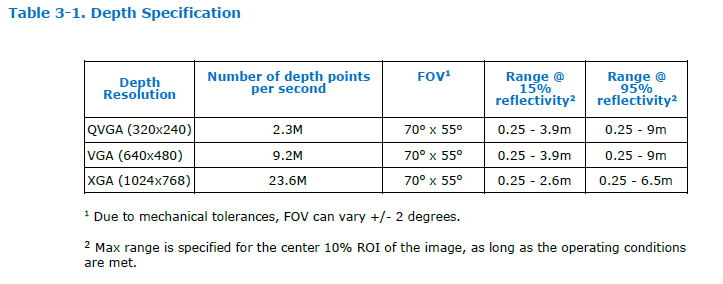
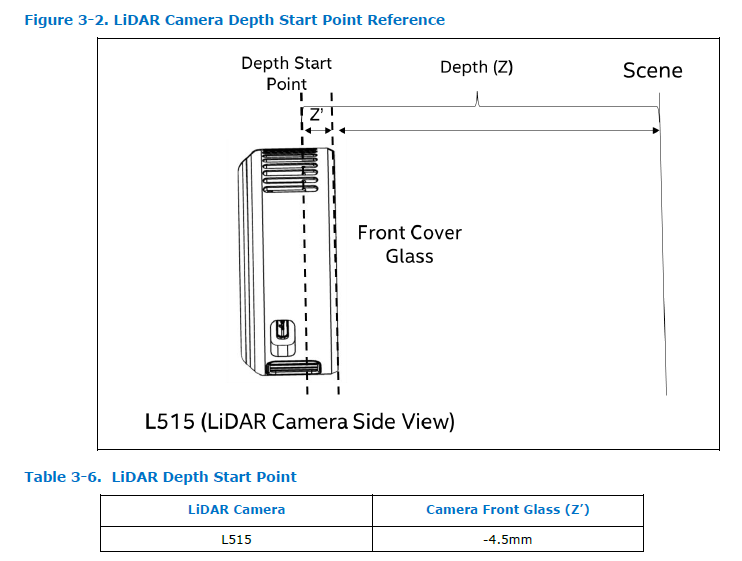
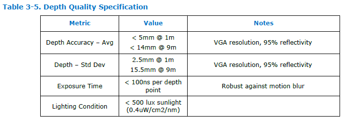

# REALSENSE L515

## 深度技術
LiDAR (光達)

## depth spec

 

## 預設設定

### 四種設定

1. Max Range
      
    適合在室內(無環境光) 光發射器的功率較大，適合目標在較遠的距離使用
2. Short Range
  
    會稍稍降低光發射器的功率，適合在目標較近的時候所使用

3. No Ambient Light
    
    無環境光時使用

4. Low Ambient Light
    
    低環境光使用

## 深度的起始點

 

## 深度品質規格

 

## 結論
- 使用Short Range 設定 
- 試試看使用VGA(640 x 480)的解析度
- 可能要考慮到環境光的因素，去看看燈條會不會影響準確度

- 深度要減去 4.5mm
- 租借的攝影機是使用 IR(紅外線) 的方式去測量深度理論上不會比較精準，且攝影機沒有支援RGB的畫面

